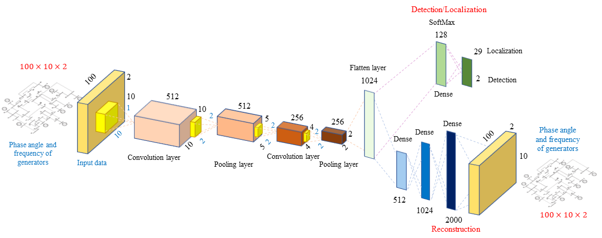
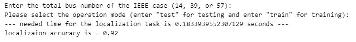
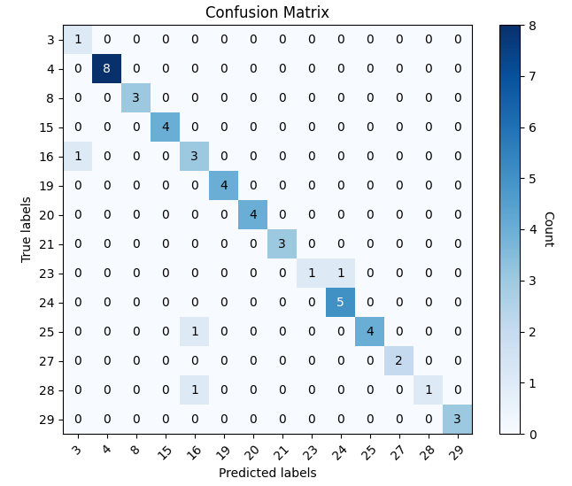
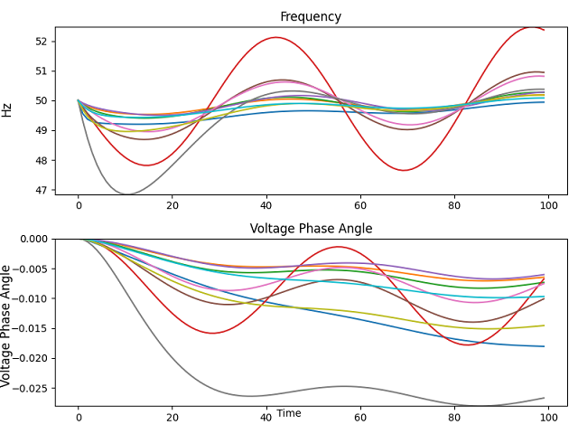
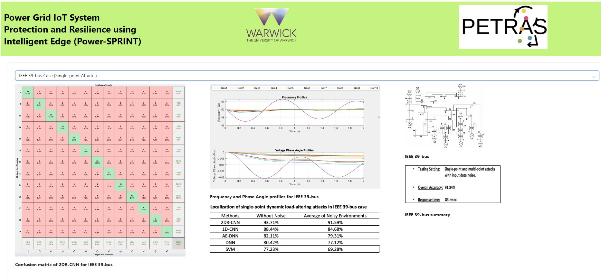
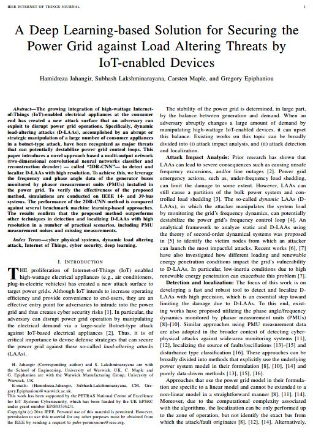

# Power Grid IoT System Protection and Resilience using Intelligent Edge (Power-SPRINT)

## This code (the bellow deep network) is designed for localization of the primary source of the load-altering threats in power grids for the Power-SPRINT project.

## If you encounter any issues with the code, please feel free to reach out to me via email at h.r.jahangir@gmail.com (Hamidreza Jahangir). I'll be happy to assist you further.

# Project Summary
https://petras-iot.org/project/power-grid-iot-system-protection-and-resilience-using-intelligent-edge-power-sprint/

### PI : Dr Subhash Lakshminarayana, Associate Professor, School of Engineering, University of Warwick, UK (Subhash.Lakshminarayana@warwick.ac.uk)
### Co-PI : Professor Carsten Maple, Professor, Warwick Manufacturing Group, University of Warwick, UK (CM@warwick.ac.uk)
### Postdoc Researcher: Dr Hamidreza Jahangir, Research Fellow, School of Engineering, University of Warwick, UK (Hamidreza.Jahangir@warwick.ac.uk)

Power-SPRINT investigates the cybersecurity risks posed by the growing integration of IoT-enabled smart-home appliances on power grid operations. 
Existing research on power grid security mainly focuses on utility-side cyber attacks and the associated SCADA system security.
In contrast, the cyber threats posed by end-user appliances on power grid operations have received little attention. 
Securing the grid against these demand-side threats is very challenging since IoT-enabled load devices are numerous and often poorly engineered from a security point of view.

By analysing network traffic from IoT-smart-home appliances, Power-SPRINT will perform threat analysis and identify the devices that are most likely to be targeted by the attacker.
Using a control theoretic-approach, Power-SPRINT will investigate the impact of compromising a large number of smart-home appliances (in a Botnet-type attack) on power grid operations
(e.g., on frequency/voltage control loops) and shed light on how the grid’s resilience can be enhanced by the optimal deployment of security reinforcements and back-up devices to mitigate these attacks.

Power-SPRINT will investigate how to detect such attacks if they occur using the power grid’s physical signals (e.g., load consumption, voltages, frequency, data gathered by existing power grid sensors)
and deep learning along with implementing a privacy-preserving mechanism that can be deployed at the edge devices.

###################################################################

# To run this code, the following libraries need to be installed:

Tensorflow (version 2 or higher),
Keras (version 2 or higher),
Scipy (version 1.4 or higher),
Numpy (version 1.18 or higher),
Matplotlib (version 3 or higher),
Xlsxwriter (version 1.3 or higher),
Scikit-learn (version 0.23 or higher),
You can install these libraries using the pip package manager. For example, you can install Tensorflow using the following command:

pip install tensorflow

Similarly, you can install other libraries using the pip install command followed by the library name.
Once you have installed these libraries, you can run the code using any Python IDE or by executing the script directly from the command line.

After installing the mentioned libraries, to use the code, please follow these instructions:

Open the code file in your preferred Python IDE or execute it directly from the command line.

After running the code, enter the IEEE case study you want to analyze (14-bus, 39-bus, or 57-bus) and choose the running mode (testing or training).

###################################################################

# NOTE: Preparing the Pre-trained models for "Test" Mode

To use the "Test" mode in the code, you need to extract (unzip) the pre-trained models for each case. Follow the steps below to set up the models for the IEEE 14-BUS case (Please do the following steps SEPARATELY for each case before running the code):

Download the files IEEE_case_14_Bus_CNN.zip.001 and IEEE_case_14_Bus_CNN.zip.002.

Select both files and extract them using your preferred unzip software.

Copy the extracted file to the main directory of the source code, "Localization of LAAs_General Code.py" or "Localization of LAAs_General Code.ipynb".

After completing these steps, you'll have the necessary pre-trained models in place for the IEEE 14-BUS case. Repeat a similar process for other cases.

The code will run and display the overall accuracy with the needed computation time, confusion matrix, and a sample of the monitoring profiles (frequency and voltage phase angles).

######################################################################
# Visualization
To visualize the results in different operation scenarios, you can use the dashboard provided in the repository by following the instructions in the Dashboard_README.md file (this repository also includes one sample snapshot of the dashboard (IEEE 39-bus.png)). 

https://646224fa2f43910ccafb6536--moonlit-mochi-6d77b0.netlify.app/

######################################################################
# Papers
Detailed information of this code can be found in our paper in IEEE Internet of Things Journal:

H. Jahangir, S. Lakshminarayana, C. Maple and G. Epiphaniou, "A Deep Learning-based Solution for Securing the Power Grid against Load Altering Threats by IoT-enabled Devices," in IEEE Internet of Things Journal (2023), doi: 10.1109/JIOT.2023.3240289.
https://ieeexplore.ieee.org/abstract/document/10026883

######################################################################

Other benchmark data-driven monitoring frameworks developed for this project are provided in the following papers:

IET Smart Grid:
Subhash Lakshminarayana,  Saurav Sthapit,  Hamidreza Jahangir,  Carsten Maple, and  H. Vincent Poor.: Data-driven detection and identification of IoT-enabled load-altering attacks in power grids. IET Smart Grid. 5( 3), 203– 218 (2022). https://doi.org/10.1049/stg2.12066

Under Review (Published on arXiv)
Hamidreza Jahangir, Subhash Lakshminarayana, and Carsten Maple. "Localizing Load-Altering Attacks Against Power Grids Using Deep Capsule Nets." arXiv preprint arXiv:2209.02809 (2022).
https://doi.org/10.48550/arXiv.2209.02809

